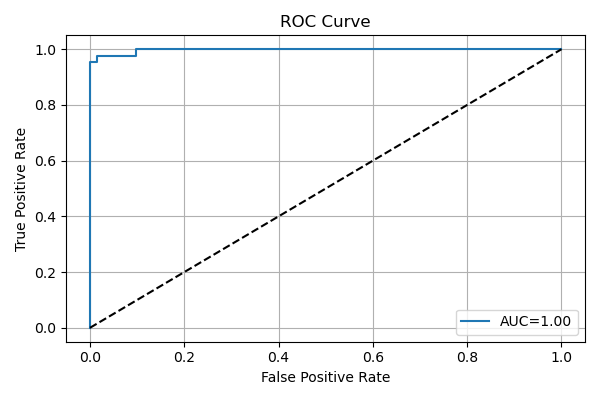

# 🔬 Breast Cancer Classification Using Logistic Regression

This project builds a binary classifier using **Logistic Regression** to detect whether a breast tumor is **malignant** or **benign** based on medical features. It uses the **Breast Cancer Wisconsin (Diagnostic)** dataset and includes complete visualizations, evaluation metrics, and threshold tuning.

---

## 📊 Dataset

- **Source**: [Breast Cancer Wisconsin Diagnostic Dataset - Kaggle](https://www.kaggle.com/datasets/uciml/breast-cancer-wisconsin-data)
- **Samples**: 569 total (malignant and benign tumors)
- **Features**: 30 numeric features derived from digitized images
- **Target Labels**:
  - `M` = Malignant → Encoded as `1`
  - `B` = Benign → Encoded as `0`

---

## 🛠️ Tools & Libraries

- Python 3
- `pandas`, `numpy`
- `scikit-learn`
- `matplotlib`, `seaborn`

---

## 🚀 Project Pipeline

### 1️⃣ Data Preprocessing
- Dropped irrelevant columns (`id`, `Unnamed: 32`)
- Mapped diagnosis: `'M' → 1`, `'B' → 0`

### 2️⃣ Train/Test Split
- 80% training and 20% testing using `train_test_split`

### 3️⃣ Feature Scaling
- Standardized features using `StandardScaler`

### 4️⃣ Model Training
- Logistic Regression (`max_iter=1000` to prevent convergence warnings)

### 5️⃣ Evaluation Metrics
- Accuracy Score
- Confusion Matrix 
- Classification Report
- ROC-AUC Score 
- ROC Curve Plot 
- Threshold tuning at **0.3** with performance comparison 

### 6️⃣ Visualizations
- **Confusion Matrix**  
  

- **ROC Curve**  
  

- **Sigmoid Function**  
  

- **Confusion Matrix (Threshold = 0.3)**  
  

---

## 📈 Results

| Metric                | Value        |
|------------------------|--------------|
| **Accuracy**           | 97.4%        |
| **Precision (1 - Malignant)** | 98%   |
| **Recall (1 - Malignant)**    | 95%   |
| **ROC AUC Score**      | **1.00**     |

- Excellent classification performance with very low false negatives.
- Threshold tuning to 0.3 improved detection sensitivity for malignant tumors.

---


##  What You’ll Learn

- How logistic regression works for binary classification
- How to evaluate a classifier beyond just accuracy
- Why ROC-AUC is important in imbalanced medical datasets
- How threshold affects precision and recall
- Visual understanding of the sigmoid function in classification

---

##  How to Run

```bash
# 1. Clone this repository
git clone https://github.com/your-username/breast-cancer-logistic-regression.git

# 2. Navigate to the folder
cd breast-cancer-logistic-regression

# 3. Install dependencies
pip install -r requirements.txt

# 4. Run the Python file or Jupyter Notebook
python breast_cancer_classification.py
# or open breast_cancer_classification.ipynb
